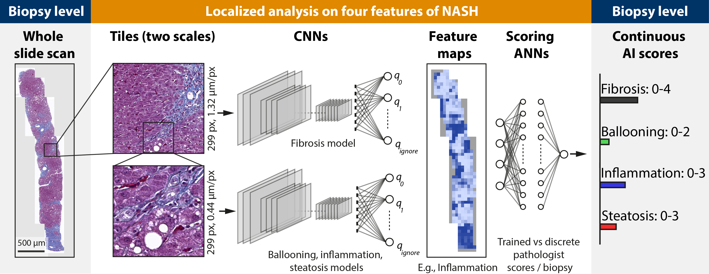
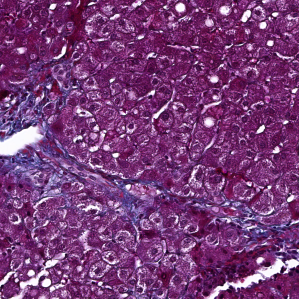

# Deep learning-based Quantification of NAFLD/NASH progression in human liver biopsies

This repository contains source code related to the publication "Deep learning-based quantification of NAFLD/NASH progression in human liver biopsies", Heinemann et al., Scientific Reports, 2022 https://www.nature.com/articles/s41598-022-23905-3.

The method analyzes microscopy images of human liver biopsies stained in Masson' Trichrome or Goldner stain. As result the four features of the pathologist-based Kleiner score (Statosis, Ballooning, Inflammation and Fibrosis) are generated. The features are in the identical numerical range as the pathologist score (e.g. 0-4 for fibrosis) but on a continuous scale.

*The method presented here is experimental and for research only. It is not approved for diagnostic use.*



## Datasets

Download data from: https://osf.io/8e7hd/

Create a folder structure as below. Unzip in the identical folders as in the osf repo. 

```bash
├── model                  # Pretrained TF / Keras models
├── ANN                    # Optional data to train ANNs from features X
├── CNN                    # Training data for CNNs
    ├── steatosis
    ├── inflammation
    ├── ballooning
    ├── fibrosis
    ├── result    
ground_truth.csv           # Table with pathologist scores
├── data                   # Data to analyze (not provided)
...                        # (This repo)
```

## Analyze a new dataset

1. Create tiles of your whole slide scans
    - Small tiles: 299px² at 0.44 µm/px
    - Big tiles: 299px² at 1.32 µm/px 

Nomenclature: _id_x_y.png_. Where x and y are the locations on the whole slide scan and id is a slide id.

Example: 114_10_19.png



2. Store the tiles to be analyzed under ./data/.

The structure shold be as follows (assuming you work on project_X):

```bash
├── ./data/
    ├── /project_X
        ├── tiles/tiles     # Tiles
        ├── tiles_big/tiles # Big tiles
```

3. Edit _classify_Kleiner_score_ANN.yaml_ to specify the location of the training data and the model files

4. Run python:
```
python classify_Kleiner_score_ANN.py -c classify_Kleiner_score_ANN.yaml
```

This will generate results as csv files (per tile and score and per slide).

## (Optional): Train CNNs (classification of tiles)    

Edit _train_CNN.py_

```
python _train.py -c _train_CNN.yaml
```

## (Optional): Train scoring ANNs (aggregate tile results to a single score)


